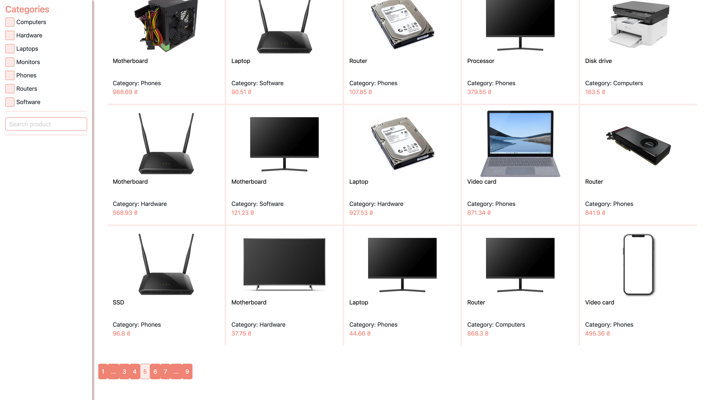

#

### Screenshots





### Commands
Don't forget rename .env.example to .env and fill it

```shell
    php artisan migrate
    php artisan db:seed
    php artisan passport:install
    php artisan serve
    
    npm run watch
```
